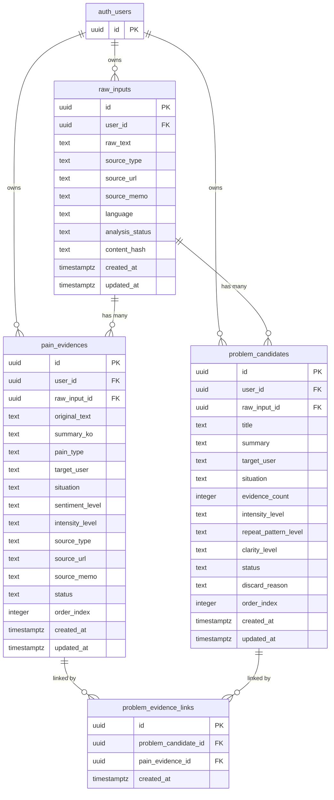

# 어노잉 레이더 — ERD_v1.2.md

## 0. 문서 목적

이 문서는 **어노잉 레이더**의 v0.1 데이터베이스 구조를 정의한다.

기준 문서:

```text
Usecase_v2.1.md
Sequence_v1.1.md
```

v1.2 수정 핵심:

- 로그인/계정 기반 사용을 전제로 `user_id`를 v0.1 핵심 테이블에 포함한다.
- 모든 핵심 데이터는 사용자 소유권을 가진다.
- `problem_evidence_links` 연결 시 candidate/evidence의 `user_id`, `raw_input_id` 불일치를 DB trigger로 차단한다.
- RLS 정책 초안을 포함한다.
- v0.1에서는 별도 `problem_cards` 테이블을 만들지 않는다.
- `problem_candidates.status = 'confirmed'`인 레코드를 **Problem Card**로 취급한다.

v0.1 핵심 흐름:

```text
Raw Input
→ Pain Evidence
→ Problem Candidate
→ Confirmed Problem Card
```

---

## 1. 설계 원칙

### 1.1 v0.1은 문제 카드 생성 흐름에 집중한다

v0.1의 DB는 다음을 안정적으로 처리한다.

- 사용자별 원문 텍스트 저장
- 출처 정보 저장
- AI 추출 Evidence 저장
- 사용자의 Evidence 검토/확정/삭제
- 확정 Evidence 기반 문제 후보 생성
- 문제 후보와 Evidence 연결
- 문제 후보 확정/폐기
- 분석 상태 관리
- 사용자별 데이터 격리

---

### 1.2 로그인/계정 기반 사용을 전제로 한다

v0.1부터 로그인 가능성을 전제로 한다.

따라서 핵심 테이블에는 `user_id`를 둔다.

```text
raw_inputs.user_id
pain_evidences.user_id
problem_candidates.user_id
```

`problem_evidence_links`에는 별도 `user_id`를 두지 않는다.

이유:

- Link는 `problem_candidate_id`와 `pain_evidence_id`를 통해 소유권을 검증할 수 있다.
- 별도 user_id를 중복 저장하면 불일치 가능성이 생긴다.
- Link 생성 시 DB trigger로 candidate/evidence의 user_id와 raw_input_id 일치를 검증한다.

---

### 1.3 프로젝트 관리는 v0.2 이후로 미룬다

v0.1에서는 `project_id`를 필수로 두지 않는다.

이유:

- 첫 경험은 프로젝트 생성이 아니라 텍스트 입력이다.
- 사용자가 의미 있는 문제 카드를 얻은 뒤 저장/분류하는 흐름이 자연스럽다.
- 프로젝트 단위 관리는 v0.2 이후 `research_projects`로 연결한다.

---

### 1.4 Problem Card 전용 테이블은 v0.1에서 만들지 않는다

v0.1에서는 `problem_candidates` 테이블 하나로 후보와 확정 카드를 관리한다.

```text
draft      = AI가 만든 문제 후보 초안
confirmed  = 사용자가 확정한 Problem Card
discarded  = 사용자가 폐기한 문제 후보
```

별도 `problem_cards` 테이블은 v0.2 이후 저장/보드/아이디어 후보화 요구가 커질 때 검토한다.

---

### 1.5 삭제보다 상태값을 우선한다

초기 구현에서는 실제 삭제보다 상태값을 사용한다.

```text
PainEvidence.status:
- draft
- confirmed
- deleted

ProblemCandidate.status:
- draft
- confirmed
- discarded
```

이유:

- AI 분석 결과를 되돌릴 수 있어야 한다.
- 사용자가 잘못 삭제/폐기한 항목을 복구할 수 있어야 한다.
- 나중에 분석 품질 개선에 활용할 수 있다.

---

## 2. 전체 ERD



---

## 3. 테이블 목록

| 테이블 | v0.1 여부 | 역할 |
|---|---:|---|
| raw_inputs | 포함 | 사용자가 붙여넣은 원문과 분석 상태 저장 |
| pain_evidences | 포함 | AI가 추출한 불만/문제 근거 문장 저장 |
| problem_candidates | 포함 | AI가 묶은 문제 후보 및 확정 Problem Card 저장 |
| problem_evidence_links | 포함 | 문제 후보와 Evidence의 N:M 연결 |
| research_projects | v0.2 | 저장된 문제 카드를 프로젝트 단위로 관리 |
| idea_candidates | v0.2 | 확정된 Problem Card 기반 아이디어 후보 저장 |
| reports | v0.3 | 문제/아이디어 리포트 저장 |

---

# 4. v0.1 테이블 상세

## 4.1 raw_inputs

사용자가 붙여넣은 원문 텍스트와 분석 상태를 저장한다.

### 컬럼

| 컬럼 | 타입 | 필수 | 설명 |
|---|---|---:|---|
| id | uuid | Y | Raw Input ID |
| user_id | uuid | Y | 소유 사용자 ID |
| raw_text | text | Y | 사용자가 붙여넣은 원문 |
| source_type | text | N | 출처 유형 |
| source_url | text | N | 출처 URL |
| source_memo | text | N | 출처 메모 |
| language | text | N | 언어 코드. 예: ko, en |
| analysis_status | text | Y | 분석 상태 |
| content_hash | text | N | 사용자별 중복 입력 감지용 해시 |
| created_at | timestamptz | Y | 생성 시각 |
| updated_at | timestamptz | Y | 수정 시각 |

### analysis_status 값

```text
idle
input_saved
extracting
extraction_failed
reviewing_evidence
grouping
grouping_failed
reviewing_candidates
completed
```

### 상태 전이

```text
idle
→ input_saved
→ extracting
→ reviewing_evidence
→ grouping
→ reviewing_candidates
→ completed
```

실패 흐름:

```text
extracting
→ extraction_failed
→ extracting

grouping
→ grouping_failed
→ grouping
```

### 제약 조건

```text
user_id는 auth.users.id를 참조한다.
raw_text는 비어 있을 수 없다.
analysis_status는 허용된 값만 사용할 수 있다.
source_url은 nullable이다.
content_hash는 nullable이지만, 있으면 사용자별 중복 감지에 사용한다.
```

---

## 4.2 pain_evidences

AI가 원문에서 추출한 불만/문제/개선 요구 문장을 저장한다.

### 컬럼

| 컬럼 | 타입 | 필수 | 설명 |
|---|---|---:|---|
| id | uuid | Y | Evidence ID |
| user_id | uuid | Y | 소유 사용자 ID |
| raw_input_id | uuid | Y | 연결된 Raw Input |
| original_text | text | Y | 원문에서 추출된 실제 문장 |
| summary_ko | text | N | 한국어 요약 |
| pain_type | text | N | 불만 유형 |
| target_user | text | N | 문제를 겪는 사용자 |
| situation | text | N | 문제가 발생하는 상황 |
| sentiment_level | text | N | 감정 방향 또는 감정 수준 |
| intensity_level | text | N | 불만 강도 |
| source_type | text | N | 출처 유형. raw_inputs에서 복사 |
| source_url | text | N | 출처 URL. raw_inputs에서 복사 |
| source_memo | text | N | 출처 메모. raw_inputs에서 복사 |
| status | text | Y | Evidence 상태 |
| order_index | integer | N | 표시 순서 |
| created_at | timestamptz | Y | 생성 시각 |
| updated_at | timestamptz | Y | 수정 시각 |

### status 값

```text
draft
confirmed
deleted
```

### status 의미

| 상태 | 의미 |
|---|---|
| draft | AI가 추출한 초안 |
| confirmed | 사용자가 문제 묶기에 사용할 Evidence로 확정 |
| deleted | 사용자가 부정확하거나 불필요하다고 삭제 처리 |

### pain_type 후보

초기에는 엄격한 enum보다 text로 둔다.

추천 값:

```text
usability
trust
cost
time_waste
manual_work
confusion
missing_feature
poor_result
comparison_difficulty
other
```

### intensity_level 후보

```text
low
medium
high
unknown
```

### sentiment_level 후보

```text
negative
mixed
neutral
unknown
```

### 제약 조건

```text
user_id는 auth.users.id를 참조한다.
raw_input_id는 raw_inputs.id를 참조한다.
original_text는 비어 있을 수 없다.
status는 draft / confirmed / deleted 중 하나여야 한다.
deleted 상태의 Evidence는 기본 문제 묶기 대상에서 제외한다.
pain_evidences.user_id는 연결된 raw_inputs.user_id와 같아야 한다.
```

`pain_evidences.user_id`와 `raw_inputs.user_id` 일치 여부는 서버 로직에서 우선 검증한다.

필요하면 별도 trigger로 강제할 수 있으나, v0.1에서는 `problem_evidence_links` 연결 검증 trigger를 필수로 둔다.

---

## 4.3 problem_candidates

AI가 확정 Evidence를 묶어 만든 문제 후보를 저장한다.

사용자가 확정하면 같은 레코드를 Problem Card로 취급한다.

### 컬럼

| 컬럼 | 타입 | 필수 | 설명 |
|---|---|---:|---|
| id | uuid | Y | Problem Candidate ID |
| user_id | uuid | Y | 소유 사용자 ID |
| raw_input_id | uuid | Y | 연결된 Raw Input |
| title | text | Y | 문제 후보 제목 |
| summary | text | N | 문제 요약 |
| target_user | text | N | 문제를 겪는 사용자 |
| situation | text | N | 문제가 발생하는 상황 |
| evidence_count | integer | Y | 연결된 Evidence 수 |
| intensity_level | text | N | 대표 감정 강도 |
| repeat_pattern_level | text | N | 반복 패턴 수준 |
| clarity_level | text | N | 문제 명확도 |
| status | text | Y | 후보 상태 |
| discard_reason | text | N | 폐기 사유 |
| order_index | integer | N | 표시 순서 |
| created_at | timestamptz | Y | 생성 시각 |
| updated_at | timestamptz | Y | 수정 시각 |

### status 값

```text
draft
confirmed
discarded
```

### status 의미

| 상태 | 의미 |
|---|---|
| draft | AI가 만든 문제 후보 초안 |
| confirmed | 사용자가 확정한 Problem Card |
| discarded | 사용자가 폐기한 문제 후보 |

### intensity_level 후보

```text
low
medium
high
unknown
```

### repeat_pattern_level 후보

```text
weak
moderate
strong
unknown
```

### clarity_level 후보

```text
unclear
partial
clear
unknown
```

### 제약 조건

```text
user_id는 auth.users.id를 참조한다.
raw_input_id는 raw_inputs.id를 참조한다.
title은 비어 있을 수 없다.
evidence_count는 0 이상이어야 한다.
status는 draft / confirmed / discarded 중 하나여야 한다.
confirmed 상태가 되려면 evidence_count가 1 이상이어야 한다.
discarded 상태일 때 discard_reason은 nullable이다.
problem_candidates.user_id는 연결된 raw_inputs.user_id와 같아야 한다.
```

`problem_candidates.user_id`와 `raw_inputs.user_id` 일치 여부는 서버 로직에서 우선 검증한다.

---

## 4.4 problem_evidence_links

Problem Candidate와 Pain Evidence의 연결을 저장한다.

하나의 문제 후보는 여러 Evidence를 가질 수 있고, 하나의 Evidence는 필요하면 여러 후보에 연결될 수 있다.

### 컬럼

| 컬럼 | 타입 | 필수 | 설명 |
|---|---|---:|---|
| id | uuid | Y | Link ID |
| problem_candidate_id | uuid | Y | Problem Candidate ID |
| pain_evidence_id | uuid | Y | Pain Evidence ID |
| created_at | timestamptz | Y | 생성 시각 |

### 제약 조건

```text
problem_candidate_id는 problem_candidates.id를 참조한다.
pain_evidence_id는 pain_evidences.id를 참조한다.
같은 problem_candidate_id + pain_evidence_id 조합은 중복될 수 없다.
연결되는 problem_candidate와 pain_evidence는 같은 user_id를 가져야 한다.
연결되는 problem_candidate와 pain_evidence는 같은 raw_input_id를 가져야 한다.
```

`user_id`, `raw_input_id` 일치 규칙은 DB trigger에서 강제한다.

---

# 5. v0.2 이후 테이블 초안

v0.2 이후 테이블은 지금 당장 만들지 않아도 된다.

다만 확장을 고려해 구조만 미리 정리한다.

---

## 5.1 research_projects

확정된 Problem Card와 Idea Candidate를 프로젝트 단위로 묶기 위한 테이블이다.

v0.2 이후 사용한다.

### 컬럼 초안

```text
id
user_id
title
purpose
category
status
created_at
updated_at
```

### status 후보

```text
active
paused
archived
```

---

## 5.2 idea_candidates

확정된 Problem Card에서 파생된 서비스 아이디어 후보를 저장한다.

v0.2 이후 사용한다.

### 컬럼 초안

```text
id
user_id
problem_candidate_id
title
one_liner
target_user
problem_statement
core_value
first_build_scope
excluded_scope
implementation_difficulty
monetization_hint
status
memo
created_at
updated_at
```

### status 후보

```text
candidate
researching
build_soon
paused
discarded
archived
```

### 연결 규칙

```text
idea_candidates.problem_candidate_id는
status = confirmed인 problem_candidates.id만 참조해야 한다.
idea_candidates.user_id는 problem_candidates.user_id와 같아야 한다.
```

---

## 5.3 reports

문제 카드와 아이디어 후보를 마크다운 리포트로 저장한다.

v0.3 이후 사용한다.

### 컬럼 초안

```text
id
user_id
title
content_md
created_at
updated_at
```

---

# 6. 상태와 도메인 규칙

## 6.1 Raw Input 상태 규칙

| 현재 상태 | 가능한 다음 상태 |
|---|---|
| idle | input_saved |
| input_saved | extracting |
| extracting | reviewing_evidence, extraction_failed |
| extraction_failed | extracting |
| reviewing_evidence | grouping |
| grouping | reviewing_candidates, grouping_failed |
| grouping_failed | grouping |
| reviewing_candidates | completed |
| completed | 없음 |

---

## 6.2 Pain Evidence 상태 규칙

| 현재 상태 | 가능한 다음 상태 |
|---|---|
| draft | confirmed, deleted |
| confirmed | draft, deleted |
| deleted | draft |

운영 규칙:

```text
confirmed Evidence만 Problem Candidate 생성에 사용한다.
deleted Evidence는 기본 목록에서 숨긴다.
deleted Evidence는 복구할 수 있다.
```

---

## 6.3 Problem Candidate 상태 규칙

| 현재 상태 | 가능한 다음 상태 |
|---|---|
| draft | confirmed, discarded |
| confirmed | draft, discarded |
| discarded | draft |

운영 규칙:

```text
draft = AI 초안
confirmed = Problem Card
discarded = 폐기 후보

confirmed 상태만 후속 Idea Candidate 생성 대상이다.
discarded 상태는 기본 목록에서 숨긴다.
```

---

## 6.4 Problem Card 확정 규칙

Problem Candidate가 Problem Card로 확정되려면 다음을 만족해야 한다.

```text
status = confirmed
evidence_count >= 1
title not empty
```

권장 조건:

```text
summary not empty
clarity_level != unclear
```

---

## 6.5 Evidence Count 관리 규칙

`problem_candidates.evidence_count`는 연결된 `problem_evidence_links` 수를 기반으로 한다.

구현 방식은 둘 중 하나를 선택한다.

### 방식 A. 저장 컬럼으로 관리

```text
problem_candidates.evidence_count
```

장점:

- 목록 조회가 빠르다.
- 카드 UI에서 바로 표시 가능하다.

단점:

- 링크 추가/삭제 시 동기화 필요.

### 방식 B. 조회 시 계산

```sql
count(problem_evidence_links.id)
```

장점:

- 데이터 불일치가 없다.

단점:

- 목록 조회 시 조인이 필요하다.

### v0.1 권장

v0.1에서는 **저장 컬럼으로 관리**한다.

대신 다음 작업에서 반드시 갱신한다.

```text
Problem Candidate 생성
Evidence 추가
Evidence 제거
Candidate 병합
Candidate 분리
```

---

## 6.6 사용자 소유권 규칙

모든 v0.1 핵심 데이터는 사용자 소유권을 가진다.

```text
raw_inputs.user_id
pain_evidences.user_id
problem_candidates.user_id
```

규칙:

```text
PainEvidence는 같은 user_id의 RawInput에만 속할 수 있다.
ProblemCandidate는 같은 user_id의 RawInput에만 속할 수 있다.
ProblemEvidenceLink는 같은 user_id와 같은 raw_input_id를 가진 Candidate/Evidence만 연결할 수 있다.
```

---

# 7. Supabase SQL 초안

아래 SQL은 v0.1 적용 가능한 초안이다.

실제 적용 전에는 프로젝트의 기존 스키마, RLS, auth 사용 여부에 맞게 조정한다.

```sql
create extension if not exists "pgcrypto";

create table raw_inputs (
  id uuid primary key default gen_random_uuid(),
  user_id uuid not null references auth.users(id) on delete cascade,
  raw_text text not null,
  source_type text,
  source_url text,
  source_memo text,
  language text,
  analysis_status text not null default 'input_saved',
  content_hash text,
  created_at timestamptz not null default now(),
  updated_at timestamptz not null default now(),

  constraint raw_inputs_analysis_status_check
    check (analysis_status in (
      'idle',
      'input_saved',
      'extracting',
      'extraction_failed',
      'reviewing_evidence',
      'grouping',
      'grouping_failed',
      'reviewing_candidates',
      'completed'
    ))
);

create table pain_evidences (
  id uuid primary key default gen_random_uuid(),
  user_id uuid not null references auth.users(id) on delete cascade,
  raw_input_id uuid not null references raw_inputs(id) on delete cascade,
  original_text text not null,
  summary_ko text,
  pain_type text,
  target_user text,
  situation text,
  sentiment_level text,
  intensity_level text,
  source_type text,
  source_url text,
  source_memo text,
  status text not null default 'draft',
  order_index integer,
  created_at timestamptz not null default now(),
  updated_at timestamptz not null default now(),

  constraint pain_evidences_status_check
    check (status in ('draft', 'confirmed', 'deleted')),

  constraint pain_evidences_sentiment_level_check
    check (
      sentiment_level is null
      or sentiment_level in ('negative', 'mixed', 'neutral', 'unknown')
    ),

  constraint pain_evidences_intensity_level_check
    check (
      intensity_level is null
      or intensity_level in ('low', 'medium', 'high', 'unknown')
    )
);

create table problem_candidates (
  id uuid primary key default gen_random_uuid(),
  user_id uuid not null references auth.users(id) on delete cascade,
  raw_input_id uuid not null references raw_inputs(id) on delete cascade,
  title text not null,
  summary text,
  target_user text,
  situation text,
  evidence_count integer not null default 0,
  intensity_level text,
  repeat_pattern_level text,
  clarity_level text,
  status text not null default 'draft',
  discard_reason text,
  order_index integer,
  created_at timestamptz not null default now(),
  updated_at timestamptz not null default now(),

  constraint problem_candidates_status_check
    check (status in ('draft', 'confirmed', 'discarded')),

  constraint problem_candidates_evidence_count_check
    check (evidence_count >= 0),

  constraint problem_candidates_confirmed_has_evidence_check
    check (
      status != 'confirmed'
      or evidence_count >= 1
    ),

  constraint problem_candidates_intensity_level_check
    check (
      intensity_level is null
      or intensity_level in ('low', 'medium', 'high', 'unknown')
    ),

  constraint problem_candidates_repeat_pattern_level_check
    check (
      repeat_pattern_level is null
      or repeat_pattern_level in ('weak', 'moderate', 'strong', 'unknown')
    ),

  constraint problem_candidates_clarity_level_check
    check (
      clarity_level is null
      or clarity_level in ('unclear', 'partial', 'clear', 'unknown')
    )
);

create table problem_evidence_links (
  id uuid primary key default gen_random_uuid(),
  problem_candidate_id uuid not null references problem_candidates(id) on delete cascade,
  pain_evidence_id uuid not null references pain_evidences(id) on delete cascade,
  created_at timestamptz not null default now(),

  constraint problem_evidence_links_unique_pair
    unique (problem_candidate_id, pain_evidence_id)
);
```

---

# 8. 관계 검증 Trigger

`problem_evidence_links`는 반드시 같은 사용자, 같은 Raw Input 안에서만 연결되어야 한다.

이 규칙은 DB trigger로 강제한다.

```sql
create or replace function validate_problem_evidence_link()
returns trigger as $$
declare
  candidate_user_id uuid;
  candidate_raw_input_id uuid;
  evidence_user_id uuid;
  evidence_raw_input_id uuid;
begin
  select user_id, raw_input_id
    into candidate_user_id, candidate_raw_input_id
  from problem_candidates
  where id = new.problem_candidate_id;

  select user_id, raw_input_id
    into evidence_user_id, evidence_raw_input_id
  from pain_evidences
  where id = new.pain_evidence_id;

  if candidate_user_id is null then
    raise exception 'problem_candidate not found: %', new.problem_candidate_id;
  end if;

  if evidence_user_id is null then
    raise exception 'pain_evidence not found: %', new.pain_evidence_id;
  end if;

  if candidate_user_id <> evidence_user_id then
    raise exception 'problem_candidate and pain_evidence must belong to the same user';
  end if;

  if candidate_raw_input_id <> evidence_raw_input_id then
    raise exception 'problem_candidate and pain_evidence must belong to the same raw_input';
  end if;

  return new;
end;
$$ language plpgsql;

create trigger trg_validate_problem_evidence_link
before insert or update on problem_evidence_links
for each row
execute function validate_problem_evidence_link();
```

---

# 9. 인덱스 SQL 초안

```sql
create index idx_raw_inputs_user_id
  on raw_inputs (user_id);

create index idx_raw_inputs_user_created_at
  on raw_inputs (user_id, created_at desc);

create index idx_raw_inputs_user_analysis_status
  on raw_inputs (user_id, analysis_status);

create index idx_raw_inputs_user_content_hash
  on raw_inputs (user_id, content_hash);

create index idx_pain_evidences_user_id
  on pain_evidences (user_id);

create index idx_pain_evidences_raw_input_id
  on pain_evidences (raw_input_id);

create index idx_pain_evidences_user_raw_input
  on pain_evidences (user_id, raw_input_id);

create index idx_pain_evidences_user_status
  on pain_evidences (user_id, status);

create index idx_pain_evidences_pain_type
  on pain_evidences (pain_type);

create index idx_pain_evidences_intensity_level
  on pain_evidences (intensity_level);

create index idx_problem_candidates_user_id
  on problem_candidates (user_id);

create index idx_problem_candidates_raw_input_id
  on problem_candidates (raw_input_id);

create index idx_problem_candidates_user_raw_input
  on problem_candidates (user_id, raw_input_id);

create index idx_problem_candidates_user_status
  on problem_candidates (user_id, status);

create index idx_problem_candidates_intensity_level
  on problem_candidates (intensity_level);

create index idx_problem_candidates_clarity_level
  on problem_candidates (clarity_level);

create index idx_problem_candidates_user_created_at
  on problem_candidates (user_id, created_at desc);

create index idx_problem_evidence_links_candidate_id
  on problem_evidence_links (problem_candidate_id);

create index idx_problem_evidence_links_evidence_id
  on problem_evidence_links (pain_evidence_id);
```

---

# 10. updated_at 처리 초안

Supabase/Postgres에서 `updated_at` 자동 갱신을 위해 공통 trigger를 둔다.

```sql
create or replace function set_updated_at()
returns trigger as $$
begin
  new.updated_at = now();
  return new;
end;
$$ language plpgsql;

create trigger trg_raw_inputs_updated_at
before update on raw_inputs
for each row
execute function set_updated_at();

create trigger trg_pain_evidences_updated_at
before update on pain_evidences
for each row
execute function set_updated_at();

create trigger trg_problem_candidates_updated_at
before update on problem_candidates
for each row
execute function set_updated_at();
```

---

# 11. RLS 방향

v0.1은 로그인/계정 기반 사용을 염두에 둔다.

LLM 호출과 상태 변경은 서버에서 통제해야 한다.

권장 구조:

```text
클라이언트
→ 서버 API Route
→ Supabase service role
→ DB
```

## 11.1 권장 접근 방식

- 클라이언트에서 Supabase 직접 쓰기 금지
- 서버 API Route에서 현재 사용자 세션을 확인
- 서버 API Route에서 `user_id = auth user id`로 데이터 생성
- 서버 API Route에서 service role로 DB 접근
- 테이블은 RLS를 켜고 기본적으로 직접 접근을 막는다

## 11.2 RLS 기본 원칙

```text
사용자는 자기 user_id 데이터만 읽을 수 있다.
사용자는 자기 user_id 데이터만 수정할 수 있다.
클라이언트 직접 insert/update/delete는 최소화한다.
상태 변경은 서버 API에서만 수행한다.
```

## 11.3 RLS SQL 초안

서버 API 전용 접근을 기본으로 하되, 향후 클라이언트 read가 필요할 때를 대비한 정책 초안이다.

```sql
alter table raw_inputs enable row level security;
alter table pain_evidences enable row level security;
alter table problem_candidates enable row level security;
alter table problem_evidence_links enable row level security;

create policy "Users can read own raw inputs"
on raw_inputs
for select
using (auth.uid() = user_id);

create policy "Users can read own pain evidences"
on pain_evidences
for select
using (auth.uid() = user_id);

create policy "Users can read own problem candidates"
on problem_candidates
for select
using (auth.uid() = user_id);

create policy "Users can read own problem evidence links"
on problem_evidence_links
for select
using (
  exists (
    select 1
    from problem_candidates pc
    where pc.id = problem_evidence_links.problem_candidate_id
      and pc.user_id = auth.uid()
  )
);
```

v0.1에서는 클라이언트 직접 write를 허용하지 않는다.

따라서 insert/update/delete policy는 만들지 않는다.

```text
insert/update/delete는 서버 API Route에서 service role로 수행한다.
service role은 RLS를 우회할 수 있으므로, 서버 API에서 반드시 user_id를 검증해야 한다.
```

---

# 12. v0.1 기준 최종 테이블

v0.1에서 실제로 만들 테이블은 다음 4개다.

```text
raw_inputs
pain_evidences
problem_candidates
problem_evidence_links
```

로그인 전제를 위해 아래 컬럼을 포함한다.

```text
raw_inputs.user_id
pain_evidences.user_id
problem_candidates.user_id
```

Link 테이블은 별도 user_id를 갖지 않는다.

대신 DB trigger로 다음을 보장한다.

```text
problem_candidate.user_id = pain_evidence.user_id
problem_candidate.raw_input_id = pain_evidence.raw_input_id
```

---

# 13. 다음 Implementation Plan에서 다룰 항목

다음 문서에서는 아래를 결정한다.

```text
1. Supabase SQL 적용 순서
2. RLS 정책 적용 방식
3. API Route 구현 순서
4. 서버 API에서 user_id 검증 방식
5. LLM 프롬프트 구조
6. Evidence 추출 로직
7. Candidate 묶기 로직
8. Candidate 확정/폐기 로직
9. 화면 구현 순서
10. 검증 기준
```

---

# 14. 현재 결정 사항 요약

| 항목 | 결정 |
|---|---|
| v0.1 테이블 수 | 4개 |
| 핵심 테이블 | raw_inputs / pain_evidences / problem_candidates / problem_evidence_links |
| 로그인 전제 | user_id를 핵심 테이블에 포함 |
| Link 소유권 | candidate/evidence의 user_id와 raw_input_id 일치 필수 |
| Link 검증 방식 | DB trigger로 강제 |
| Problem Card 테이블 | v0.1에서는 만들지 않음 |
| Problem Card 기준 | problem_candidates.status = confirmed |
| 프로젝트 테이블 | v0.2 이후 |
| 아이디어 후보 테이블 | v0.2 이후 |
| 리포트 테이블 | v0.3 이후 |
| 삭제 방식 | hard delete보다 status 우선 |
| Evidence Count | v0.1에서는 저장 컬럼으로 관리 |
| 구현 난이도 | idea_candidates 단계에서 판단 |
| RLS 권장 | 서버 API 전용 접근 + 사용자별 소유권 |
| 클라이언트 write | v0.1에서는 허용하지 않음 |
