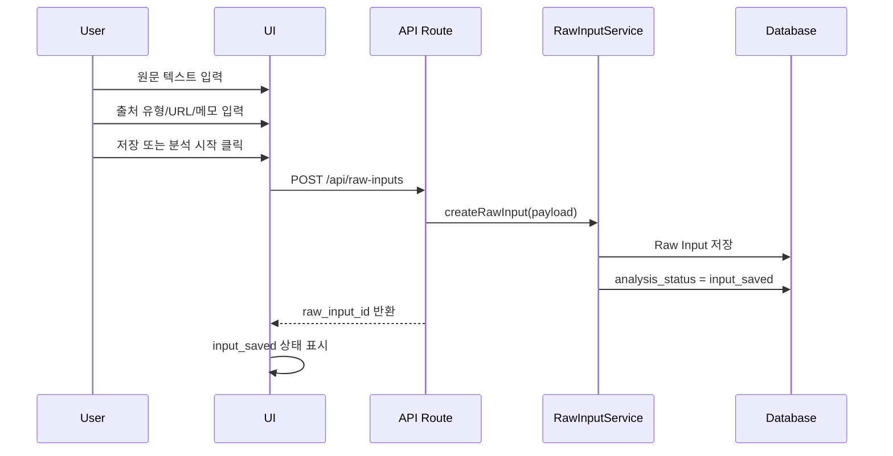
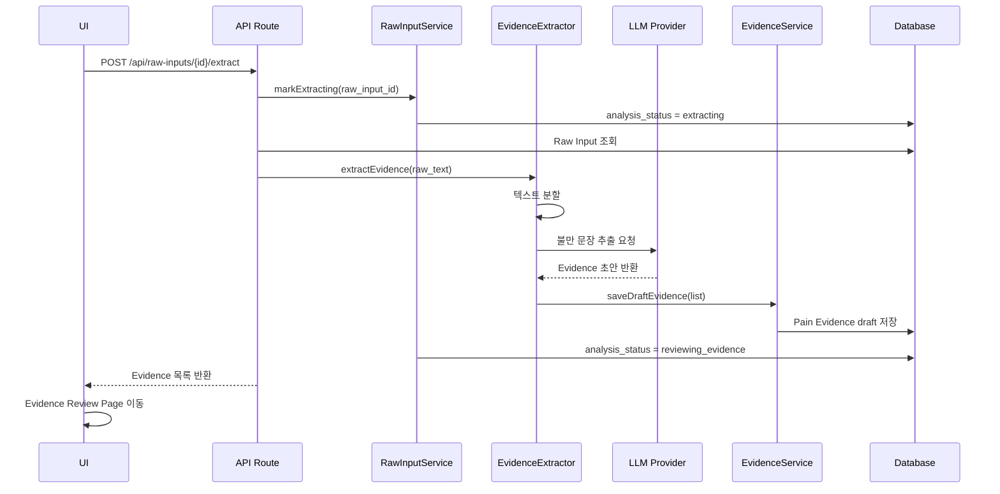
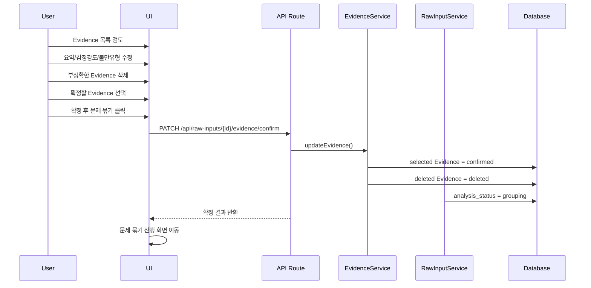
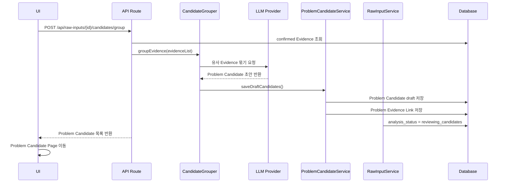
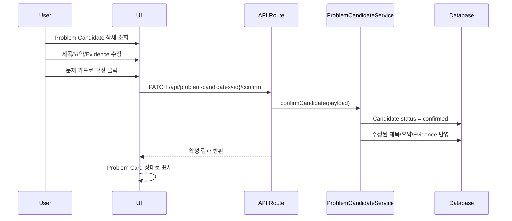
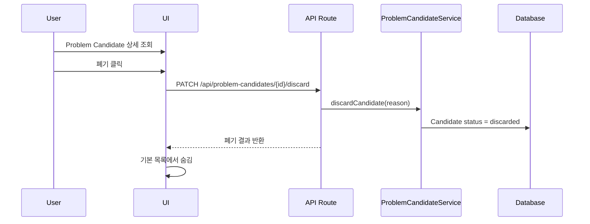
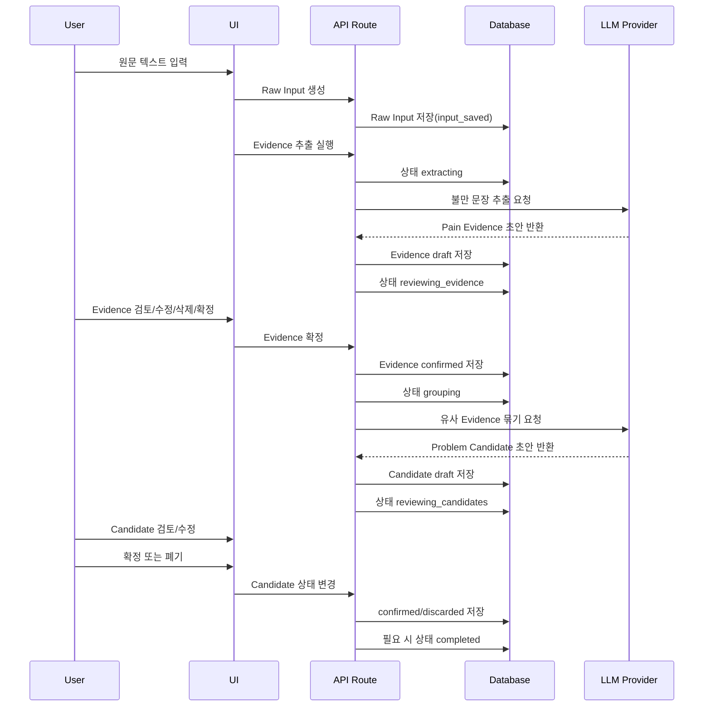

# 어노잉 레이더 — Sequence_v1.1.md

## 0. 문서 목적

이 문서는 **어노잉 레이더**의 v0.1 핵심 흐름을 시퀀스 기준으로 확정한다.

기준 문서:

```text
Usecase_v2.1.md
```

v1.1에서는 이전 `Sequence.md`의 상태 전이 불일치를 정리했다.

핵심 수정:

- `SEQ-01 Raw Input 생성`은 `input_saved`까지만 책임진다.
- `SEQ-02 Pain Evidence 추출`이 `extracting`부터 책임진다.
- 상태 전이 책임을 각 시퀀스에 명확히 분리한다.
- Class.md / Logic.md에서 수정사항이 누적되지 않도록 상태, 책임, 데이터 변경 기준을 고정한다.

---

## 1. v0.1 시퀀스 범위

v0.1에서는 다음 5개 시퀀스만 구현 대상으로 본다.

| ID | 시퀀스 | 목적 |
|---|---|---|
| SEQ-01 | Raw Input 생성 | 사용자가 원문 텍스트와 출처 정보를 저장한다 |
| SEQ-02 | Pain Evidence 추출 | AI가 원문에서 불만 후보 문장을 추출한다 |
| SEQ-03 | Evidence 검토/확정 | 사용자가 AI 추출 결과를 수정하고 확정한다 |
| SEQ-04 | Problem Candidate 생성 | 확정 Evidence를 유사 문제 후보로 묶는다 |
| SEQ-05 | Problem Card 확정/폐기 | 사용자가 문제 후보를 최종 문제 카드로 확정하거나 폐기한다 |

v0.1에서 제외하는 시퀀스:

- Idea Candidate 생성
- Idea Board 저장
- 리서치 프로젝트 생성/연결
- 마크다운 리포트 내보내기
- 외부 URL 자동 수집
- 자동 트렌드 모니터링

---

## 2. 공통 액터와 컴포넌트

| 이름 | 역할 |
|---|---|
| User | 원문 입력, Evidence 검토, 문제 후보 확정/폐기 수행 |
| UI | 입력 화면, 검토 화면, 문제 후보 화면 제공 |
| API Route | 클라이언트 요청을 받아 서버 로직 실행 |
| RawInputService | Raw Input 저장, 분석 상태 변경 |
| EvidenceExtractor | AI를 호출해 Pain Evidence 초안 생성 |
| EvidenceService | Evidence 저장, 수정, 삭제, 확정 |
| CandidateGrouper | 확정 Evidence를 Problem Candidate로 묶음 |
| ProblemCandidateService | Candidate 저장, 병합, 분리, 확정, 폐기 |
| LLM Provider | OpenAI API 또는 Claude API |
| Database | Supabase/Postgres |

---

## 3. 공통 상태값

분석 상태는 `Raw Input` 기준으로 관리한다.

```text
idle
input_saved
extracting
extraction_failed
reviewing_evidence
grouping
grouping_failed
reviewing_candidates
completed
```

### 3.1 정상 상태 전이

```text
idle
→ input_saved
→ extracting
→ reviewing_evidence
→ grouping
→ reviewing_candidates
→ completed
```

### 3.2 실패 상태 전이

```text
extracting
→ extraction_failed
→ extracting

grouping
→ grouping_failed
→ grouping
```

### 3.3 상태 전이 책임

| 상태 변경 | 담당 시퀀스 | 담당 컴포넌트 |
|---|---|---|
| idle → input_saved | SEQ-01 | RawInputService |
| input_saved → extracting | SEQ-02 | RawInputService |
| extracting → reviewing_evidence | SEQ-02 | RawInputService |
| extracting → extraction_failed | SEQ-02 | RawInputService |
| reviewing_evidence → grouping | SEQ-03 | RawInputService |
| grouping → reviewing_candidates | SEQ-04 | RawInputService |
| grouping → grouping_failed | SEQ-04 | RawInputService |
| reviewing_candidates → completed | SEQ-05 | RawInputService |

### 3.4 상태 전이 규칙

- Raw Input 생성만으로는 AI 분석을 시작하지 않는다.
- Raw Input 생성 직후 상태는 `input_saved`다.
- 사용자가 분석 실행을 요청하면 `extracting`으로 변경한다.
- 실패 상태에서도 Raw Input과 기존 Evidence는 삭제하지 않는다.
- `completed`는 모든 후보가 처리됐거나 사용자가 검토 완료를 명시했을 때만 적용한다.

---

# 4. SEQ-01 — Raw Input 생성

## 4.1 목적

사용자가 프로젝트 생성 없이 원문 텍스트와 출처 정보를 저장한다.

이 시퀀스는 AI 분석을 실행하지 않는다.

## 4.2 관련 유즈케이스

- UC-01 원문 텍스트 입력
- UC-02 출처 정보 등록

## 4.3 사전 조건

- 사용자가 어노잉 레이더에 접속해 있다.
- 로그인은 v0.1에서 필수 조건으로 보지 않는다.
- 프로젝트 생성은 선행하지 않는다.

## 4.4 입력값

| 필드 | 필수 | 설명 |
|---|---:|---|
| raw_text | Y | 사용자가 붙여넣은 원문 텍스트 |
| source_type | N | Reddit, App Review, G2/Capterra Review, Product Hunt, Naver Cafe, DCInside, Community, 기타 |
| source_url | N | 원문 URL |
| source_memo | N | 출처 메모 |
| language | N | 감지 가능하면 자동 저장 |

## 4.5 정상 흐름



## 4.6 단계별 상세

1. 사용자가 첫 화면에서 원문 텍스트를 붙여넣는다.
2. 사용자가 출처 유형을 선택한다.
3. 사용자가 선택적으로 URL 또는 출처 메모를 입력한다.
4. 사용자가 저장 또는 분석 시작 버튼을 누른다.
5. UI는 입력값을 API Route로 전송한다.
6. API Route는 RawInputService를 호출한다.
7. RawInputService는 Raw Input을 저장한다.
8. RawInputService는 `analysis_status = input_saved`로 설정한다.
9. API Route는 `raw_input_id`를 반환한다.
10. UI는 저장 완료 상태 또는 분석 실행 대기 상태를 표시한다.

## 4.7 데이터 생성/변경

### 생성

```text
RawInput
```

### 변경

```text
RawInput.analysis_status = input_saved
```

## 4.8 예외 흐름

### E-01. 텍스트가 너무 짧음

조건:

```text
raw_text 길이가 최소 기준보다 짧음
```

처리:

- 저장은 허용할 수 있다.
- UI에 “분석에 충분하지 않을 수 있음” 경고를 표시한다.
- 사용자가 계속 진행하면 저장한다.

### E-02. 텍스트가 너무 김

조건:

```text
raw_text 길이가 1회 분석 기준을 초과함
```

처리:

- UI에 분할 분석 안내를 표시한다.
- 저장은 허용한다.
- 실제 분할 처리는 SEQ-02에서 수행한다.

### E-03. 중복 입력 의심

조건:

```text
동일하거나 매우 유사한 raw_text가 최근 입력에 존재함
```

처리:

- UI에 중복 가능성 경고를 표시한다.
- 사용자가 계속 진행하면 별도 Raw Input으로 저장한다.

## 4.9 완료 조건

- Raw Input이 저장되어 있다.
- `analysis_status = input_saved` 상태다.
- 다음 시퀀스 `SEQ-02 Pain Evidence 추출`이 실행될 수 있다.

---

# 5. SEQ-02 — Pain Evidence 추출

## 5.1 목적

AI가 Raw Input에서 불만, 문제, 개선 요구, 반복되는 귀찮음, 대안 요청 문장을 추출한다.

## 5.2 관련 유즈케이스

- UC-03 불만 문장 추출

## 5.3 사전 조건

- Raw Input이 존재한다.
- `analysis_status = input_saved` 또는 `analysis_status = extraction_failed` 상태다.

## 5.4 입력값

| 필드 | 설명 |
|---|---|
| raw_input_id | 분석 대상 Raw Input ID |
| raw_text | 원문 텍스트 |
| source_type | 출처 유형 |
| source_url | 출처 URL |
| source_memo | 출처 메모 |

## 5.5 정상 흐름



## 5.6 단계별 상세

1. UI는 Raw Input ID를 기준으로 추출 API를 호출한다.
2. API Route는 RawInputService에 `markExtracting(raw_input_id)`를 요청한다.
3. RawInputService는 `analysis_status = extracting`으로 변경한다.
4. API Route는 Raw Input을 조회한다.
5. EvidenceExtractor는 원문을 분석 가능한 단위로 분할한다.
6. EvidenceExtractor는 LLM Provider에 불만 문장 추출을 요청한다.
7. LLM Provider는 Evidence 초안을 반환한다.
8. EvidenceService는 각 Evidence를 `draft` 상태로 저장한다.
9. RawInputService는 `analysis_status = reviewing_evidence`로 변경한다.
10. UI는 Evidence Review Page로 이동한다.

## 5.7 추출 대상

- 불편함
- 짜증
- 반복되는 귀찮음
- 이해하기 어려움
- 시간이 오래 걸림
- 돈 낭비
- 수동 반복 작업
- 기존 도구 불만
- 대안 요청
- 해결되지 않은 니즈
- “wish”, “hate”, “annoying”, “frustrating” 계열 표현

## 5.8 제외 대상

- 단순 칭찬
- 광고 문구
- 정보성 문장
- 농담
- 맥락 없는 욕설
- 출처 불명확한 주장
- 해결책만 있고 문제가 없는 문장

## 5.9 데이터 생성/변경

### 생성

```text
PainEvidence[]
```

### 변경

```text
RawInput.analysis_status = extracting
PainEvidence.status = draft
RawInput.analysis_status = reviewing_evidence
```

## 5.10 Pain Evidence 저장 필드

```text
id
raw_input_id
original_text
summary_ko
pain_type
target_user
situation
sentiment_level
intensity_level
source_type
source_url
source_memo
status
created_at
updated_at
```

## 5.11 예외 흐름

### E-01. LLM 호출 실패

조건:

```text
LLM API 에러, 타임아웃, 네트워크 오류
```

처리:

- `analysis_status = extraction_failed`로 변경한다.
- UI에 재시도 버튼을 표시한다.
- Raw Input은 삭제하지 않는다.
- 기존 Evidence가 있다면 유지한다.

### E-02. 추출 결과 없음

조건:

```text
AI가 유의미한 Evidence를 찾지 못함
```

처리:

- `analysis_status = reviewing_evidence`로 이동할 수 있다.
- UI에 “명확한 불만이 적음” 상태를 표시한다.
- 사용자는 원문을 수정하거나 재분석할 수 있다.

### E-03. 추출 결과 과다

조건:

```text
Evidence 초안이 과도하게 많음
```

처리:

- 감정 강도, 중복도, 문장 명확도를 기준으로 우선순위를 붙인다.
- Review 화면에서는 상위 항목을 먼저 보여준다.

## 5.12 완료 조건

- Pain Evidence draft가 저장되어 있다.
- `analysis_status = reviewing_evidence` 상태다.
- 다음 시퀀스 `SEQ-03 Evidence 검토/확정`이 실행될 수 있다.

---

# 6. SEQ-03 — Evidence 검토/확정

## 6.1 목적

사용자가 AI가 추출한 Pain Evidence 초안을 검토하고, 문제 묶기에 사용할 Evidence만 확정한다.

## 6.2 관련 유즈케이스

- UC-04 추출 결과 검토/편집

## 6.3 사전 조건

- Pain Evidence draft가 1개 이상 존재한다.
- `analysis_status = reviewing_evidence` 상태다.

## 6.4 입력값

| 필드 | 설명 |
|---|---|
| raw_input_id | 검토 대상 Raw Input ID |
| evidence_ids | 확정할 Evidence ID 목록 |
| edited_fields | 사용자가 수정한 요약, 감정 강도, 불만 유형 등 |
| deleted_evidence_ids | 삭제 처리할 Evidence ID 목록 |

## 6.5 정상 흐름



## 6.6 단계별 상세

1. 사용자는 Evidence Review Page에서 추출 결과를 확인한다.
2. 사용자는 부정확한 Evidence를 삭제한다.
3. 사용자는 요약 문구를 수정한다.
4. 사용자는 감정 강도를 수정한다.
5. 사용자는 불만 유형을 수정한다.
6. 사용자는 문제 묶기에 사용할 Evidence를 선택한다.
7. 사용자가 `확정 후 문제 묶기`를 누른다.
8. EvidenceService는 선택된 Evidence를 `confirmed` 상태로 변경한다.
9. 삭제한 Evidence는 `deleted` 상태로 변경한다.
10. RawInputService는 `analysis_status = grouping`으로 변경한다.
11. UI는 문제 묶기 진행 화면으로 이동한다.

## 6.7 데이터 변경

```text
PainEvidence.status = confirmed
PainEvidence.status = deleted
RawInput.analysis_status = grouping
```

## 6.8 예외 흐름

### E-01. 확정할 Evidence가 없음

조건:

```text
사용자가 confirmed로 선택한 Evidence가 없음
```

처리:

- 문제 묶기로 넘어가지 않는다.
- UI에 “확정할 Evidence를 1개 이상 선택해야 합니다” 메시지를 표시한다.

### E-02. Evidence 수정값 유효성 오류

조건:

```text
요약이 비어 있음
감정 강도 값이 허용 범위를 벗어남
불만 유형 값이 정의되지 않음
```

처리:

- 저장하지 않는다.
- 해당 필드에 오류 메시지를 표시한다.

### E-03. 원문 수정 후 재분석

조건:

```text
사용자가 Raw Input을 수정하고 재분석을 요청함
```

처리:

- 기존 Evidence는 유지하거나 archive 처리한다.
- Raw Input 수정본을 저장한다.
- `analysis_status = input_saved`로 되돌린다.
- 사용자가 다시 분석을 실행하면 SEQ-02로 돌아간다.

## 6.9 완료 조건

- confirmed 상태의 Pain Evidence가 1개 이상 존재한다.
- `analysis_status = grouping` 상태다.
- 다음 시퀀스 `SEQ-04 Problem Candidate 생성`이 실행될 수 있다.

---

# 7. SEQ-04 — Problem Candidate 생성

## 7.1 목적

확정된 Pain Evidence를 유사 문제 단위로 묶고, AI가 문제 후보 초안을 생성한다.

## 7.2 관련 유즈케이스

- UC-05 유사 불만 묶기
- UC-06 문제 후보 카드 조회

## 7.3 사전 조건

- confirmed 상태의 Pain Evidence가 1개 이상 존재한다.
- `analysis_status = grouping` 상태다.

## 7.4 입력값

| 필드 | 설명 |
|---|---|
| raw_input_id | 분석 대상 Raw Input ID |
| confirmed_evidence | confirmed 상태의 Evidence 목록 |

## 7.5 정상 흐름



## 7.6 단계별 상세

1. UI는 문제 묶기 API를 호출한다.
2. API Route는 confirmed 상태의 Evidence를 조회한다.
3. CandidateGrouper는 Evidence 목록을 LLM Provider에 전달한다.
4. LLM Provider는 유사 Evidence를 문제 후보 단위로 묶는다.
5. CandidateGrouper는 각 후보에 임시 제목과 요약을 생성한다.
6. ProblemCandidateService는 각 후보를 `draft` 상태로 저장한다.
7. Problem Evidence Link를 저장한다.
8. RawInputService는 `analysis_status = reviewing_candidates`로 변경한다.
9. UI는 Problem Candidate Page로 이동한다.

## 7.7 묶기 기준

Problem Candidate는 다음 기준을 만족해야 한다.

- 같은 사용자가 겪는 문제인가
- 같은 상황에서 발생하는가
- 같은 행동 흐름에서 발생하는가
- 같은 해결책으로 접근 가능한가
- 표현만 다르고 본질이 같은가

## 7.8 데이터 생성/변경

### 생성

```text
ProblemCandidate[]
ProblemEvidenceLink[]
```

### 변경

```text
ProblemCandidate.status = draft
RawInput.analysis_status = reviewing_candidates
```

## 7.9 Problem Candidate 저장 필드

```text
id
raw_input_id
title
summary
target_user
situation
evidence_count
intensity_level
repeat_pattern_level
clarity_level
status
created_at
updated_at
```

## 7.10 예외 흐름

### E-01. 묶기 실패

조건:

```text
LLM 호출 실패
파싱 실패
후보 생성 실패
```

처리:

- `analysis_status = grouping_failed`로 변경한다.
- UI에 재시도 버튼을 표시한다.
- confirmed Evidence는 유지한다.

### E-02. Evidence가 1개뿐임

조건:

```text
confirmed Evidence 수가 1개
```

처리:

- 시스템은 단일 Problem Candidate를 생성할 수 있다.
- 카드에 `근거 부족` 배지를 표시한다.

### E-03. 너무 많은 후보 생성

조건:

```text
Problem Candidate 수가 과도하게 많음
```

처리:

- 근거 수, 감정 강도, 문제 명확도 기준으로 정렬한다.
- UI에서는 상위 후보를 먼저 보여준다.
- 사용자는 후보를 병합/폐기할 수 있다.

## 7.11 완료 조건

- draft 상태의 Problem Candidate가 생성되어 있다.
- Problem Evidence Link가 저장되어 있다.
- `analysis_status = reviewing_candidates` 상태다.
- 다음 시퀀스 `SEQ-05 Problem Card 확정/폐기`가 실행될 수 있다.

---

# 8. SEQ-05 — Problem Card 확정/폐기

## 8.1 목적

사용자가 AI가 만든 Problem Candidate를 검토하고, 의미 있는 후보만 Problem Card로 확정한다.

## 8.2 관련 유즈케이스

- UC-07 문제 후보 상세 조회
- UC-08 문제 카드 확정/폐기

## 8.3 사전 조건

- draft 상태의 Problem Candidate가 존재한다.
- `analysis_status = reviewing_candidates` 상태다.

## 8.4 입력값

| 필드 | 설명 |
|---|---|
| problem_candidate_id | 확정/폐기 대상 후보 ID |
| title | 사용자가 수정한 문제 제목 |
| summary | 사용자가 수정한 문제 요약 |
| evidence_links | 후보와 연결된 Evidence 목록 |
| action | confirm 또는 discard |
| discard_reason | 폐기 사유. 선택 입력 |

## 8.5 정상 흐름 — 확정



## 8.6 정상 흐름 — 폐기



## 8.7 단계별 상세

1. 사용자는 Problem Candidate 목록에서 후보를 클릭한다.
2. UI는 후보 상세 화면을 연다.
3. 사용자는 제목과 요약을 수정한다.
4. 사용자는 Evidence 원문과 출처를 확인한다.
5. 사용자는 잘못 연결된 Evidence를 제거한다.
6. 사용자는 필요한 경우 Evidence를 다른 후보로 이동한다.
7. 사용자는 후보를 확정하거나 폐기한다.
8. 확정 시 `ProblemCandidate.status = confirmed`가 된다.
9. 폐기 시 `ProblemCandidate.status = discarded`가 된다.
10. 확정된 Candidate만 Problem Card로 취급한다.
11. 모든 후보 처리가 끝나면 Raw Input의 `analysis_status`를 `completed`로 변경할 수 있다.

## 8.8 데이터 변경

### 확정

```text
ProblemCandidate.status = confirmed
ProblemCandidate.title = edited_title
ProblemCandidate.summary = edited_summary
ProblemEvidenceLink = updated_links
```

### 폐기

```text
ProblemCandidate.status = discarded
ProblemCandidate.discard_reason = optional_reason
```

### 완료

```text
RawInput.analysis_status = completed
```

## 8.9 Candidate / Card 규칙

```text
Problem Candidate = AI가 만든 문제 후보 초안
Problem Card = 사용자가 직접 확정한 문제 결과물
```

구현 규칙:

- 별도 `problem_cards` 테이블은 v0.1에서 만들지 않는다.
- `status = confirmed`인 Problem Candidate를 Problem Card로 본다.
- `status = draft`인 Candidate는 최종 산출물이 아니다.
- `status = discarded`인 Candidate는 기본 목록에서 숨긴다.
- Idea Candidate는 `confirmed` 상태에서만 생성할 수 있다.

## 8.10 예외 흐름

### E-01. 근거 없는 후보 확정 시도

조건:

```text
Problem Candidate에 연결된 Evidence가 0개
```

처리:

- 확정할 수 없다.
- UI에 “근거가 없는 문제 후보는 확정할 수 없습니다” 메시지를 표시한다.

### E-02. 제목 또는 요약이 비어 있음

조건:

```text
title 또는 summary가 비어 있음
```

처리:

- 확정할 수 없다.
- 필수 입력 오류를 표시한다.

### E-03. 일부 후보만 처리됨

조건:

```text
일부 Candidate는 confirmed/discarded, 일부는 draft 상태로 남음
```

처리:

- Raw Input을 바로 completed로 바꾸지 않을 수 있다.
- 남은 draft가 있으면 `reviewing_candidates`를 유지한다.
- 사용자가 “검토 완료”를 누르면 `completed`로 변경한다.

### E-04. 폐기 후보 복구

조건:

```text
사용자가 discarded 후보 복구 요청
```

처리:

- `ProblemCandidate.status = draft`로 되돌린다.
- 기본 후보 목록에 다시 표시한다.

## 8.11 완료 조건

- 사용자가 의미 있는 후보를 Problem Card로 확정했다.
- 불필요한 후보는 discarded 처리됐다.
- confirmed 상태의 Candidate만 후속 아이디어 후보화 대상이 된다.
- 필요 시 Raw Input이 `completed` 상태가 된다.

---

# 9. v0.1 전체 흐름 요약



---

# 10. 화면 전환 요약

```text
Input First Page
→ Extracting State
→ Extraction Review Page
→ Grouping State
→ Problem Candidate Page
→ Problem Detail Page
→ Confirmed Problem Card State
```

## 10.1 Input First Page

진입 조건:

```text
사용자가 어노잉 레이더에 접속
```

이탈 조건:

```text
Raw Input 저장 완료
analysis_status = input_saved
```

---

## 10.2 Extracting State

진입 조건:

```text
사용자가 Evidence 추출 실행
analysis_status = extracting
```

이탈 조건:

```text
Evidence draft 저장 완료
analysis_status = reviewing_evidence
```

---

## 10.3 Extraction Review Page

진입 조건:

```text
analysis_status = reviewing_evidence
```

이탈 조건:

```text
confirmed Evidence 1개 이상
analysis_status = grouping
```

---

## 10.4 Problem Candidate Page

진입 조건:

```text
analysis_status = reviewing_candidates
```

이탈 조건:

```text
Candidate 상세 조회
또는 Candidate 확정/폐기
```

---

## 10.5 Problem Detail Page

진입 조건:

```text
Problem Candidate 또는 Problem Card 존재
```

이탈 조건:

```text
Candidate 확정
Candidate 폐기
Candidate 목록으로 복귀
```

---

# 11. 핵심 API 초안

실제 구현에서 API 이름은 변경 가능하다.

## 11.1 Raw Input

```text
POST /api/raw-inputs
GET /api/raw-inputs/{rawInputId}
PATCH /api/raw-inputs/{rawInputId}
```

## 11.2 Evidence Extraction

```text
POST /api/raw-inputs/{rawInputId}/extract
```

## 11.3 Evidence Review

```text
GET /api/raw-inputs/{rawInputId}/evidence
PATCH /api/raw-inputs/{rawInputId}/evidence
PATCH /api/raw-inputs/{rawInputId}/evidence/confirm
```

## 11.4 Candidate Grouping

```text
POST /api/raw-inputs/{rawInputId}/candidates/group
GET /api/raw-inputs/{rawInputId}/candidates
```

## 11.5 Candidate Review

```text
GET /api/problem-candidates/{candidateId}
PATCH /api/problem-candidates/{candidateId}
PATCH /api/problem-candidates/{candidateId}/confirm
PATCH /api/problem-candidates/{candidateId}/discard
PATCH /api/problem-candidates/{candidateId}/restore
```

---

# 12. 다음 문서 연결

이 문서 이후 작성 순서는 다음과 같다.

```text
Usecase_v2.1.md
→ Sequence_v1.1.md
→ Class.md
→ Logic.md
```

다음 문서인 `Class.md`에서는 아래 객체의 책임을 정의한다.

```text
RawInput
PainEvidence
ProblemCandidate
ProblemEvidenceLink
SourceInfo
AnalysisStatus
EvidenceExtractor
CandidateGrouper
ProblemCandidateService
```

---

# 13. 현재 결정 사항 요약

| 항목 | 결정 |
|---|---|
| v0.1 핵심 흐름 | Raw Input → Evidence → Candidate → Card |
| 첫 화면 | 텍스트 입력 중심 |
| 프로젝트 생성 | v0.1 선행 조건 아님 |
| SEQ-01 책임 | Raw Input 저장, input_saved까지 |
| SEQ-02 책임 | extracting부터 Evidence draft 저장까지 |
| Problem Candidate | AI가 만든 문제 후보 초안 |
| Problem Card | 사용자가 확정한 문제 결과물 |
| Candidate/Card 구분 | `status = confirmed` 여부로 구분 |
| 초기 지표 | 근거 수 / 감정 강도 / 반복 패턴 / 문제 명확도 |
| 구현 난이도 | v0.2 아이디어 후보화 단계에서 판단 |
| 분석 상태 | Raw Input 기준 analysis_status |
| 실패 처리 | extraction_failed / grouping_failed |
| 최근 분석 | v0.1에서는 최근 3개 빠른 재진입만 제공 |
| 후속 문서 | Class.md |
